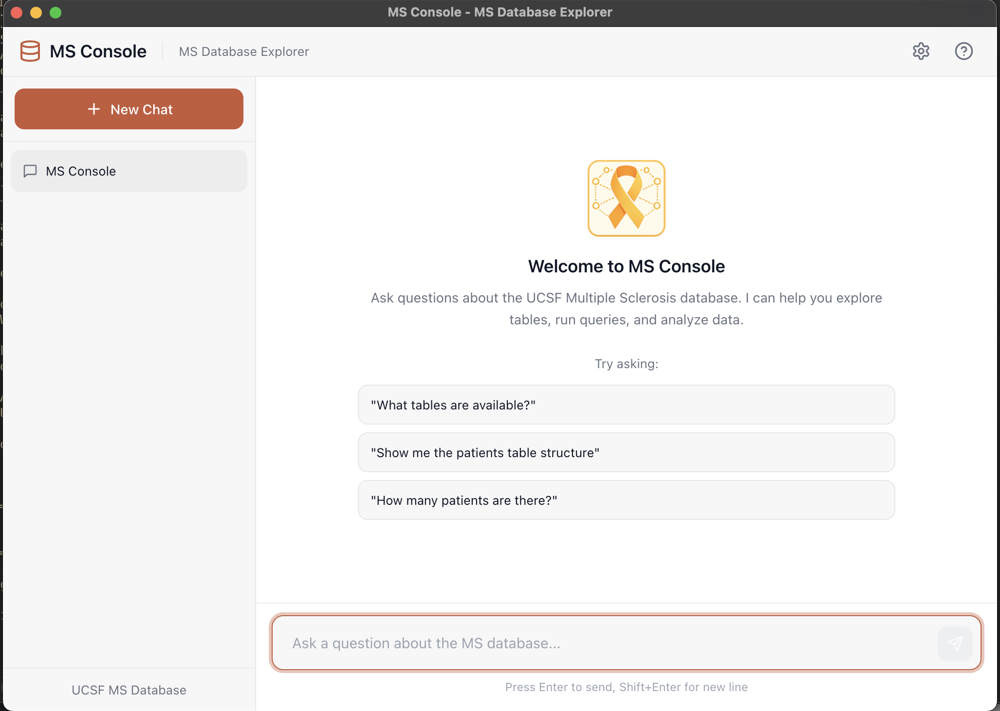

# MS Console 
<br>

A desktop application for exploring and analyzing the UCSF Multiple Sclerosis Medical Database using OpenAI's GPT models and natural language queries.

<br>



## Features

- 🔬 **Natural Language Queries**: Ask questions about the MS database in plain English
- 📊 **Database Exploration**: List tables, view schemas, and run SQL queries
- 🔄 **Real-time Streaming**: See responses as they're generated token-by-token
- 🛠️ **Tool Visualization**: View database queries and their results in expandable panels
- 💾 **Conversation History**: Save and manage multiple chat sessions
- ⚙️ **Configurable Settings**: Customize API keys, models, and database connections
- 🔒 **Read-Only Access**: All database operations are restricted to SELECT queries for safety

## Prerequisites

- **Node.js** 18+ and npm
- **OpenAI API Key**
- Access to the UCSF MS Database (credentials provided separately)

**Note**: Python is bundled with the application. No separate Python installation is required.

## Installation

### For End Users

Download the pre-built application from the releases:

1. **macOS**: Download the `.dmg` file, open it, and drag MS Console to Applications
2. **Windows**: Download the `.exe` installer and run it
3. **Linux**: Download the `.AppImage` and make it executable

### For Developers

#### 1. Clone or extract the project

```bash
cd MSConsole
```

#### 2. Install dependencies

```bash
npm install
```

This will automatically:
- Install Node.js dependencies
- Set up the Python virtual environment using the bundled Python runtime
- Install all Python dependencies

**Note**: The standalone Python runtime is included in the `runtime/` folder, so no system Python installation is needed.

## Running the Application

### Development Mode

The Python backend starts automatically with Electron. Simply run:

```bash
# Build the renderer once
npm run build:renderer

# Start the application
npm start
```

Or use the development mode with auto-rebuild:

```bash
npm run dev
```

The app will:
- Automatically start the Python backend using the bundled runtime
- Launch the Electron window
- Hot-reload on changes (in dev mode)

### Production Build

Build for your platform:

```bash
# All platforms (from respective OS)
npm run build

# macOS (DMG and ZIP)
npm run build:mac

# Windows (NSIS installer and ZIP)
npm run build:win

# Linux (AppImage and DEB)
npm run build:linux
```

The build process will:
1. Set up the Python virtual environment with the bundled runtime
2. Build the React frontend with webpack
3. Package the application with electron-builder
4. Create installers in the `release/` directory

Built applications are fully self-contained with:
- Python 3.12.1 runtime
- All Python dependencies
- Electron framework
- React frontend

## Configuration

On first launch, you'll be prompted to configure settings:

### Required Settings

- **OpenAI API Key**: Your API key from [platform.openai.com](https://platform.openai.com/api-keys)

### Optional Settings

- **Model**: Choose from GPT-5.2 (default), GPT-4.1, GPT-4o, GPT-4o Mini, or custom models
- **Database Settings**: Pre-configured for UCSF MS Database, but can be customized

### Environment Variables (Alternative)

You can also configure via `.env` file or environment variables:

```env
OPENAI_API_KEY=sk-your-api-key-here
OPENAI_MODEL=gpt-5.2
MYSQL_HOST=queryms.ucsf.edu
MYSQL_PORT=3306
MYSQL_USERNAME=medcp
MYSQL_PASSWORD=your-password
MYSQL_DATABASE=imsms
SERVER_PORT=8765
```

## Usage

### Basic Queries

- "What tables are available in the database?"
- "Show me the structure of the patients table"
- "How many patients are in the database?"
- "Find all patients diagnosed after 2020"
- "What are the most common medications prescribed?"

### Advanced Queries

- "Join the patients and visits tables to show visit frequency"
- "Calculate the average age at diagnosis"
- "Show trends in patient enrollment by year"

### Tips

- The assistant will automatically explore the database schema when needed
- Use the "Show tool calls" option to see the actual SQL queries being run
- All queries are read-only for data safety
- Use LIMIT clauses for large result sets

## Project Structure

```
MSConsole/
├── src/
│   ├── main/                  # Electron main process
│   │   ├── main.js            # App entry point, window management
│   │   └── preload.js         # IPC bridge for renderer
│   └── renderer/              # React frontend
│       ├── components/        # React components
│       ├── styles/            # CSS styles
│       ├── App.jsx            # Main app component
│       └── index.jsx          # React entry point
├── python/
│   ├── msconsole_server.py    # FastAPI server with streaming
│   └── requirements.txt       # Python dependencies
├── runtime/                   # Standalone Python 3.12.1 runtime
│   ├── bin/                   # Python executables
│   └── lib/                   # Python standard library
├── scripts/
│   └── setup-python.js        # Python environment setup script
├── assets/                    # Icons and images
├── package.json               # Node.js config and scripts
├── webpack.config.js          # Frontend build config
└── PYTHON_SETUP.md            # Detailed Python setup documentation
```

## Architecture

### Frontend (Electron + React)

- **Electron Main Process**: Manages windows, settings storage, Python backend lifecycle
- **React Renderer**: ChatGPT-like UI with message bubbles, tool call panels
- **IPC Bridge**: Secure communication between main and renderer processes

### Backend (Python + FastAPI)

- **FastAPI Server**: HTTP API with Server-Sent Events for streaming
- **MS Console Agent**: OpenAI function-calling agent with database tools
- **Read-Only Enforcement**: SQL queries are validated before execution

### Data Flow

1. User sends message via React UI
2. Electron main process forwards to Python backend
3. Python calls OpenAI API with database tools
4. Streaming events (tokens, tool calls, results) sent back
5. React UI updates in real-time

## Troubleshooting

### Backend Won't Start

If you see "Error: connect ECONNREFUSED 127.0.0.1:8765":

**Development Mode:**
```bash
# Recreate the Python environment
npm run python:setup

# Then restart the app
npm start
```

**Production Build:**
- The Python environment is bundled with the app
- If issues persist, rebuild the application: `npm run build:mac` (or your platform)
- Check the console logs for detailed error messages

**Common Issues:**
- Port 8765 is already in use (check for other instances)
- Python virtual environment is corrupted (run `npm run python:setup`)
- Missing Python dependencies (reinstall with `npm run python:setup`)

### Connection Errors

- Verify your OpenAI API key is valid at [platform.openai.com](https://platform.openai.com/api-keys)
- Check database credentials are correct in Settings
- Ensure network access to queryms.ucsf.edu (may require VPN)
- Test connectivity: try opening Settings and clicking "Test Connection"

### Streaming Not Working

- Confirm "Stream tokens" is enabled in Settings
- Check the DevTools console for errors (View → Developer → Toggle Developer Tools)
- Try refreshing or restarting the app
- Verify backend is running (check for Python process)

## Python Environment

This application uses a **standalone Python runtime** to ensure consistency across all platforms.

### Key Features

- **Bundled Runtime**: Python 3.12.1 is included in the `runtime/` folder
- **Virtual Environment**: Isolated dependencies in `venv/` folder
- **Automatic Setup**: Environment created automatically during `npm install`
- **No System Python**: No system Python installation required
- **Portable**: Works on any machine without Python pre-installed

### Manual Setup

If you need to recreate the Python environment:

```bash
npm run python:setup
```

This will:
1. Remove existing `venv/` folder
2. Create new virtual environment using runtime Python
3. Install all dependencies from `python/requirements.txt`
4. Configure relative paths for portability

For more details, see [PYTHON_SETUP.md](PYTHON_SETUP.md).

## Security Notes

- API keys are stored using Electron's secure storage when available
- Database credentials are encrypted at rest
- All SQL queries are validated to be read-only before execution
- The app never exports or modifies patient data

## License

MIT License - See LICENSE file for details.

## Support

For issues or questions, please contact the UCSF MS Research team or open an issue on [GitHub](https://github.com/Broccolito/MSConsole).

<br>

**Disclaimer**: This application is intended for research purposes only. Always follow proper data handling and privacy protocols when working with medical data.
