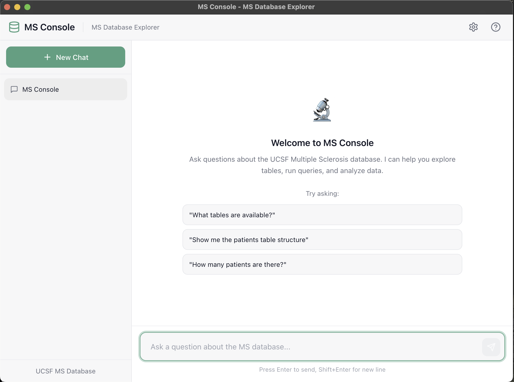

# MS Console 

A desktop application for exploring and analyzing the UCSF Multiple Sclerosis Medical Database using OpenAI's GPT models and natural language queries.



## Features

- 🔬 **Natural Language Queries**: Ask questions about the MS database in plain English
- 📊 **Database Exploration**: List tables, view schemas, and run SQL queries
- 🔄 **Real-time Streaming**: See responses as they're generated token-by-token
- 🛠️ **Tool Visualization**: View database queries and their results in expandable panels
- 💾 **Conversation History**: Save and manage multiple chat sessions
- ⚙️ **Configurable Settings**: Customize API keys, models, and database connections
- 🔒 **Read-Only Access**: All database operations are restricted to SELECT queries for safety

## Prerequisites

- **Node.js** 18+ and npm
- **Python** 3.9+
- **OpenAI API Key**
- Access to the UCSF MS Database (credentials provided separately)

## Installation

### 1. Clone or extract the project

```bash
cd MSConsole
```

### 2. Install Node.js dependencies

```bash
npm install
```

### 3. Install Python dependencies

```bash
pip install -r python/requirements.txt
```

Or use a virtual environment:

```bash
python -m venv venv
source venv/bin/activate  # On Windows: venv\Scripts\activate
pip install -r python/requirements.txt
```

## Running the Application

### Development Mode

1. **Start the Python backend** (in one terminal):

```bash
npm run python:start
# Or directly:
python python/msconsole_server.py
```

2. **Build and start Electron** (in another terminal):

```bash
npm run build:renderer
npm start
```

Or use the combined development command:

```bash
npm run dev
```

### Production Build

Build for your platform:

```bash
# All platforms (from respective OS)
npm run build

# Windows
npm run build:win

# macOS
npm run build:mac

# Linux
npm run build:linux
```

Built applications will be in the `release/` directory.

## Configuration

On first launch, you'll be prompted to configure settings:

### Required Settings

- **OpenAI API Key**: Your API key from [platform.openai.com](https://platform.openai.com/api-keys)

### Optional Settings

- **Model**: Choose from GPT-5.2 (default), GPT-4.1, GPT-4o, GPT-4o Mini, or custom models
- **Database Settings**: Pre-configured for UCSF MS Database, but can be customized

### Environment Variables (Alternative)

You can also configure via `.env` file or environment variables:

```env
OPENAI_API_KEY=sk-your-api-key-here
OPENAI_MODEL=gpt-5.2
MYSQL_HOST=queryms.ucsf.edu
MYSQL_PORT=3306
MYSQL_USERNAME=medcp
MYSQL_PASSWORD=your-password
MYSQL_DATABASE=imsms
SERVER_PORT=8765
```

## Usage

### Basic Queries

- "What tables are available in the database?"
- "Show me the structure of the patients table"
- "How many patients are in the database?"
- "Find all patients diagnosed after 2020"
- "What are the most common medications prescribed?"

### Advanced Queries

- "Join the patients and visits tables to show visit frequency"
- "Calculate the average age at diagnosis"
- "Show trends in patient enrollment by year"

### Tips

- The assistant will automatically explore the database schema when needed
- Use the "Show tool calls" option to see the actual SQL queries being run
- All queries are read-only for data safety
- Use LIMIT clauses for large result sets

## Project Structure

```
MSConsole/
├── src/
│   ├── main/                  # Electron main process
│   │   ├── main.js            # App entry point, window management
│   │   └── preload.js         # IPC bridge for renderer
│   └── renderer/              # React frontend
│       ├── components/        # React components
│       ├── styles/            # CSS styles
│       ├── App.jsx            # Main app component
│       └── index.jsx          # React entry point
├── python/
│   ├── msconsole_server.py    # FastAPI server with streaming
│   └── requirements.txt       # Python dependencies
├── assets/                    # Icons and images
├── package.json               # Node.js config and scripts
└── webpack.config.js          # Frontend build config
```

## Architecture

### Frontend (Electron + React)

- **Electron Main Process**: Manages windows, settings storage, Python backend lifecycle
- **React Renderer**: ChatGPT-like UI with message bubbles, tool call panels
- **IPC Bridge**: Secure communication between main and renderer processes

### Backend (Python + FastAPI)

- **FastAPI Server**: HTTP API with Server-Sent Events for streaming
- **MS Console Agent**: OpenAI function-calling agent with database tools
- **Read-Only Enforcement**: SQL queries are validated before execution

### Data Flow

1. User sends message via React UI
2. Electron main process forwards to Python backend
3. Python calls OpenAI API with database tools
4. Streaming events (tokens, tool calls, results) sent back
5. React UI updates in real-time

## Troubleshooting

### Backend Won't Start

- Check Python is in your PATH
- Verify all dependencies are installed: `pip install -r python/requirements.txt`
- Check port 8765 isn't in use

### Connection Errors

- Verify your OpenAI API key is valid
- Check database credentials are correct
- Ensure network access to queryms.ucsf.edu

### Streaming Not Working

- Confirm "Stream tokens" is enabled in Settings
- Check browser console for errors
- Try refreshing or restarting the app

## Security Notes

- API keys are stored using Electron's secure storage when available
- Database credentials are encrypted at rest
- All SQL queries are validated to be read-only before execution
- The app never exports or modifies patient data

## License

MIT License - See LICENSE file for details.

## Support

For issues or questions, please contact the UCSF MS Research team.

<br>

**Disclaimer**: This application is intended for research purposes only. Always follow proper data handling and privacy protocols when working with medical data.
